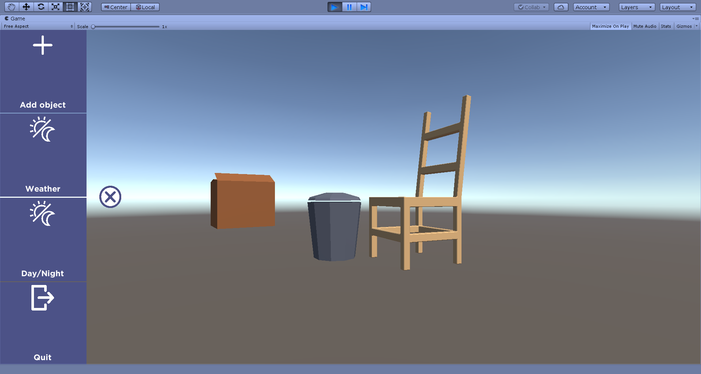
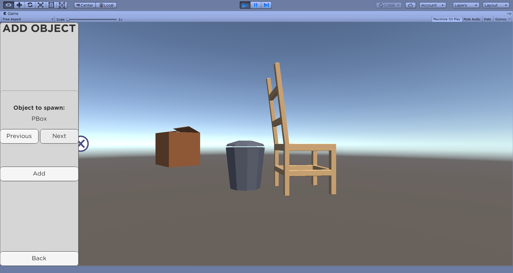
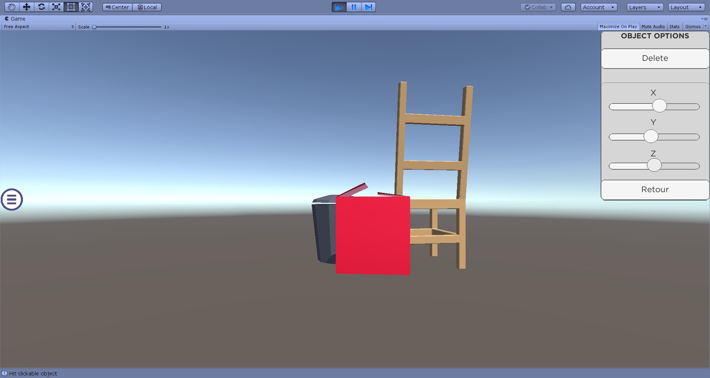

# Unity_MobileSlidingMenu

A sliding menu for applications made with unity. Menu is better suited for mobile apps.

You can:
- add GameObject
- delete GameObject
- change position of GameObject
- change light
- wheather button is a dummy

